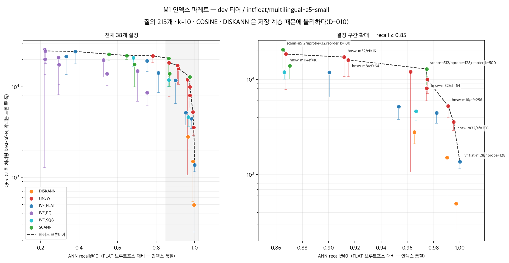

# VecShift

**임베딩 모델을 바꾸는 동안에도 검색은 멈추지 않는다.**

RAG 서비스에서 임베딩 모델 교체는 언젠가가 아니라 반드시 일어난다. 모델이 바뀌면
벡터 공간 자체가 달라지므로 기존 인덱스는 전부 무효가 되고, 전량 재색인이 강제된다.
그런데 검색은 24/7 떠 있어야 한다.

VecShift 는 Milvus 위에서 이 재색인을 **다운타임 없이**, **품질 회귀를 사전에 차단**하면서,
실패 시 **10초 안에 되돌릴 수 있게** 만드는 운영 하네스다.

> **상태: W1 · W2(M1) · W3(M2) 완료 → W4(리포트) 예정.** 표의 수치는 전부 실측이다.
> 목표를 못 맞춘 항목과 아직 안 잰 항목은 ⚠ 로 표시했다 — 숨기지 않는다.

---

## 결과

### 검색 베이스라인 — 실측 (dev 티어 50 K · MIRACL ko dev 213 질의)

| 지표 | 값 |
|---|---|
| nDCG@10 | **0.8291 ± 0.0203** |
| Recall@10 | **0.8694 ± 0.0203** |
| 임베딩 + 적재 | 182 s (274 rows/s, MPS) |
| 검색 지연 | 0.2 ms/질의 (213 질의 37 ms) |

`intfloat/multilingual-e5-small` (384 dim) · HNSW M=16 efConstruction=200 · COSINE.
**티어를 반드시 함께 읽을 것** — 50 K 부분집합은 전량(1.4 M)보다 과제가 훨씬 쉽다
(정답 밀도 1 % 대 0.036 %). 전량 수치와 나란히 놓으면 안 된다. D-006 · D-014 참고.

재현: `make ingest && make eval`

### M1 인덱스 파레토 — 실측 (dev 티어 50 K · 38개 설정)



같은 recall 에서 무엇이 더 빠른가. **인접 설정의 QPS 차이가 16 % 이하면 구분하지 않는다**
— 그게 이 장비의 측정 노이즈 바닥이다(D-022).

| 설정 | ANN recall@10 | QPS | 판정 |
|---|---:|---:|---|
| scann nprobe=32, reorder_k=100 | 0.8653 | 20,612 | HNSW 와 **구분 안 됨** |
| hnsw M=16, ef=16 | 0.8676 | 18,427 | |
| **scann nprobe=128, reorder_k=500** | **0.9746** | **12,855** | **29 % 빠름 — 유의** |
| hnsw M=32, ef=64 | 0.9751 | 9,951 | |
| hnsw M=32, ef=256 | 0.9953 | 3,559 | recall 0.99+ 는 HNSW 뿐 |

**결론이 세 번 바뀌었다.** 알고리즘이 아니라 측정 방법 때문이다 —
SCANN 의 정련 파라미터를 빠뜨렸고(D-018), QPS 대표값이 재현되지 않았고(D-021),
노이즈 바닥 아래 차이를 읽고 있었다(D-022). 과정을 DECISIONS 에 그대로 남겼다.

**말하지 않는 것**: DISKANN 순위(저장 계층 때문에 불리 — D-010),
PQ 순위(파레토 축에 메모리가 없다 — D-020), 용량 산정(배치 처리량이지 동시 QPS 가 아니다).

재현: `make sweep`

### 재색인 — 실측 (dev 티어 50 K · 워커 8 · 부하 중 스왑)

| 지표 | 목표 | 실측 |
|---|---|---|
| 재색인 중 다운타임 | 0 s | **0** |
| alias 스왑 소요 | ≤ 5 s | **226 ms** |
| 롤백 소요 | ≤ 10 s | **198 ms** |
| 부하 중 오류 | 0 건 | **0 / 67,422** |
| 품질 게이트 | 회귀 시 중단 | **통과** nDCG@10 0.8251 → 0.8508 |
| 재색인 중 p99 증가 | ≤ +15 % | **전환 1초 창에서 +94 %** ⚠ |
| 전량 재색인 소요 | ≤ 30 min | **미달** — 1.4 M 외삽 시 약 4.6 h ⚠ |
| 쓰기 유실 | 0 건 | **미측정** |

**트래픽이 실제로 옮겨갔다는 증거**: v2 가 18,675 건을 처리했다(t=11~21s).
요청마다 어느 컬렉션을 쳤는지 기록한다 — 오류가 없다는 것만으로 성공이라 쓰지 않는다.

| 구간 | 대상 | p99 | 처리량 |
|---|---|---:|---:|
| t=0~10 | v1 | ~7.5 ms | ~2,400/s |
| **t=11** | **v1:164 / v2:1,533** | **14.57 ms** | 1,697 |
| t=12~20 | v2 | ~8.3 ms | ~1,850/s |
| t=22~29 | v1 (롤백 후) | ~6.7 ms | ~2,520/s |

**두 가지 비용을 섞지 말 것.** 전환 자체는 1초 창(재해석 주기)에 끝나고 그 창의 p99 만
튄다. v2 정상 상태의 p99 +19 % · 처리량 −24 % 는 스왑이 아니라 **768 차원의 비용**이다.

재현: `make shift`

### 저장 계층 — 실측 (D-010)

외장 USB 볼륨은 내장 대비 4k 랜덤 읽기가 **8.6배 느리다** (4,057 vs 34,945 IOPS).
순차는 2.1배 차이였다. 인덱스 비교를 절대값으로 읽으면 안 되는 이유다.
재현: `make iobench`

*(아키텍처 다이어그램 자리 — W4)*

---

## 재현

```bash
make venv-full  # Python 3.12 가상환경 + 의존성 (torch 포함, 수 GB)
make up         # Milvus 3.0.1 Standalone 기동 (healthz 대기 포함)
make doctor     # 환경 점검
make ingest     # MIRACL 적재 — 다운로드 → 샘플링 → 임베딩 → Milvus
make eval       # 골든셋으로 nDCG@10 · Recall@10
make sweep      # M1 — 인덱스 38종 스윕과 파레토 곡선
make ingest-v2  # v2(e5-base 768d) 적재 — 재색인 대상
make shift      # M2 — 부하 중 v1 → v2 무중단 스왑 + 롤백
```

캐시는 전부 저장소 안(`cache/`)으로 떨어진다. 기본값인 `~/.cache` 는 내장 디스크라
코퍼스와 모델 가중치가 쌓이면 터진다 — D-012.

`make help` 로 전체 타깃을 볼 수 있다.

---

## 구성

```
config/vecshift.yml   설정 단일 진입점 (코드에 상수를 박지 않는다)
src/vecshift/         패키지 — config / client / paths / dataset / embed /
                      collection / evaluate / sweep / plot / load / shift / cli
docker-compose.yml    Milvus 3.0.1 공식 compose (vendoring, minio 레지스트리만 수정 — D-008)
docs/vecshift-plan.html   기획서 — 문제 정의부터 4주 계획까지
scripts/iobench.sh    컨테이너 내부 랜덤 I/O 측정 (make iobench)
reports/              파레토 곡선 등 산출물
DECISIONS.md          선택의 근거와 막힌 기록
```

---

## 측정의 한계 — 미리 밝혀둔다

이 저장소의 수치를 읽을 때 알아야 할 것들이다. 숨기는 것보다 적어두는 쪽이 낫다.

1. **합성 부하다.** 실제 프로덕션 트래픽이 아니라 Zipf 분포 생성기다. 실제와 다를 수
   있는 지점은 리포트에 구체적으로 적는다.
2. **단일 노트북 벤치다.** 절대 수치는 의미가 약하다. 모든 결과는 *"동일 하드웨어·
   동일 데이터에서의 상대 비교"* 로만 서술한다. "3,200 QPS" 가 아니라 "같은 조건에서
   IVF 대비 2.3배" 가 이 저장소의 문장 형식이다.
3. **저장 계층이 외장 USB 볼륨 위에 있고, 랜덤 I/O 가 느리다.** 순차는 내장 대비
   읽기 2.1배 차이지만 **4k 랜덤 읽기는 8.6배** 차이다 (4,057 vs 34,945 IOPS).
   ANN 그래프 탐색은 작은 블록을 흩뿌리는 패턴이라 정확히 이 손해를 본다.
   인덱스 비교 수치를 절대값으로 읽으면 안 되는 가장 큰 이유다.
   측정 방법과 전체 수치는 [DECISIONS.md](DECISIONS.md) D-010, 직접 재보려면
   `make iobench`.
4. **벤치 수치는 캐시를 벗어난 워킹셋에서만 의미가 있다.** 같은 장비에서 워킹셋을
   512 MiB 로 잡으면 랜덤 읽기가 8배 부풀려진다 — `--direct=1` 을 줘도 그렇다.
   게스트의 O_DIRECT 는 macOS 호스트 캐시를 막지 못한다. D-011 참고.
5. **recall 은 두 종류다.** 인덱스 품질(ANN recall)과 검색 품질(qrels 기준)을
   섞어 읽으면 안 된다. D-007 참고.
6. **골든셋이 213 질의뿐이다.** MIRACL ko dev 가 그만큼이다. 질의당 점수의 분산이
   크므로 모든 검색 품질 수치에 **표준오차를 함께 낸다.** ± 구간이 겹치는 두 수치를
   "좋아졌다"고 쓰지 않는다. D-015 참고.
7. **QPS 는 배치 처리량이고 노이즈 바닥이 16 % 다.** 213 질의를 한 번의 호출로 보내고
   잰 값이라 동시 클라이언트 QPS 가 아니다 — 용량 산정에 쓸 수 없다. 대표값은
   best-of-N 이며(간섭은 시간을 더할 뿐이므로), 두 설정의 차이가 16 % 이하면
   "더 빠르다"고 쓰지 않는다. D-017 · D-021 · D-022 참고.
8. **티어마다 정답 밀도가 다르다.** 골든셋 정답 503개를 샘플에 무조건 포함시키므로
   (D-014), dev 50 K 에서는 정답 밀도가 1 % 지만 전량 1.4 M 에서는 0.036 % 다.
   **티어가 다른 recall 을 같은 표에 넣지 않는다.** D-006 · D-014 참고.

---

## 데이터셋

[MIRACL](https://huggingface.co/datasets/miracl/miracl-corpus) Korean (v1.0-ko) —
한국어 위키 기반 약 1.4 M passage, **사람이 라벨링한 qrels** 포함.

## 라이선스

Apache-2.0
