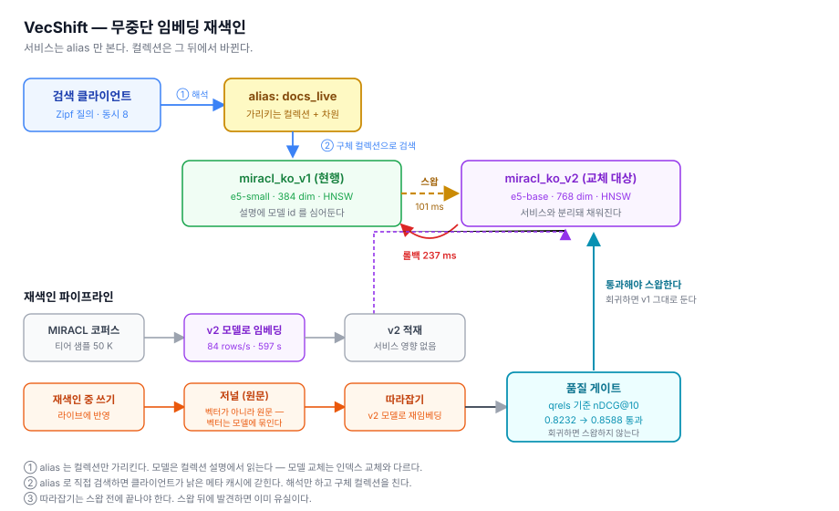

# VecShift

**임베딩 모델을 바꾸는 동안에도 검색은 멈추지 않는다.**

RAG 서비스에서 임베딩 모델 교체는 언젠가가 아니라 반드시 일어난다. 모델이 바뀌면
벡터 공간 자체가 달라져 기존 인덱스는 전부 무효가 되고, 전량 재색인이 강제된다.
그런데 검색은 24/7 떠 있어야 한다.

VecShift 는 Milvus 위에서 이 재색인을 **다운타임 없이**, **품질 회귀를 사전에 차단**하면서,
실패 시 **초 단위로 되돌릴 수 있게** 만드는 운영 하네스다.



---

## 결과

기획서가 정한 성공 기준 8개 중 **6개 달성 · 1개 미달 · 1개 판정 불가**. 셋 다 그대로 싣는다.

| 기준 | 목표 | 실측 | |
|---|---|---|:-:|
| 재색인 중 다운타임 | 0 s | **0** | ✅ |
| 쓰기 유실 | 0 건 | **0 / 48** | ✅ |
| 부하 중 오류 | 0 건 | **0 / 55,954** | ✅ |
| alias 스왑 소요 | ≤ 5 s | **70 ms** | ✅ |
| 롤백 소요 | ≤ 10 s | **42 ms** | ✅ |
| 품질 게이트 | 회귀 시 중단 | **통과 · 유의한 개선** nDCG@10 0.8890 → 0.9187 (대응 t=2.97) | ✅ |
| 재색인 중 p99 증가 | ≤ +15 % | 1초 창 해상도에서 **노이즈와 구분 불가** | ➖ |
| 전량 재색인 소요 | ≤ 30 min | 1.4 M 외삽 **약 11.8 h** (bge-m3) · 이 장비로는 도달 불가 | ⚠️ |

dev 티어 50 K · `multilingual-e5-small`(384d) → **`bge-m3`(1024d)** · 워커 8 · Zipf 질의 ·
읽기 부하 30 s 중간에 스왑 후 롤백, 쓰기 8/s 동시 수행.

**절대 수치가 아니라 동일 조건 상대 비교로만 읽을 것** — 단일 노트북 벤치다.

**교체 대상 모델을 바꿨다.** 처음엔 e5-base(768d)로 교체했는데, 평가 코드의 오류를 고치고 다시
재니 **e5-base 는 e5-small 보다 낫지 않았다**(−0.0078, 유의하지 않음). 무중단 교체를 보여주면서
나아지지 않는 모델로 교체하는 건 앞뒤가 안 맞는다. 세 모델을 비교해 유의하게 나은 bge-m3 로
바꾸고 다시 쟀다 — D-033 · D-034.

**p99 목표는 판정할 수 없다.** 스왑 창의 p99(10.5 ms)가 스왑이 없던 창(11.3 ms)보다 낮았다.
1초 창 하나의 p99 는 아무 일 없어도 두 배씩 튄다. 요청 단위 표본이 있어야 판정할 수 있다 — D-035.

**재색인 30분 목표는 레버를 전부 재고 도달 불가로 결론냈다.** 병목은 MPS 임베딩이고, 배치 크기는
레버가 아니라 천장이다. 더 나은 모델(bge-m3)은 e5-base 보다 재색인이 3배 느리다 — D-032 · D-033.

```bash
make up && make ingest && make shift     # 기동 → 적재 → 부하 중 무중단 스왑
```

---

## 이 저장소가 내세우는 것은 성공이 아니라 실패 기록이다

무중단 스왑은 **세 번 실패한 뒤에** 됐다. 그 과정이 [DECISIONS.md](DECISIONS.md) 35건에 있다.

- **모델 품질 평가가 인덱스 오차에 오염돼 있었다.** 평가가 HNSW 기본값(ef=16)으로 검색해서
  ANN 이 놓친 이웃만큼 점수가 깎였고, 깎인 양이 모델마다 달라 **순위까지 뒤집혔다.**
  "인덱스 품질과 모델 품질을 섞지 말라"(D-007)를 적은 것도 나, 어긴 코드를 쓴 것도 나다.
  이 오류는 에러 없이 4개 결정 기록에 퍼져 있었고, **W3 의 "더 좋은 모델로 교체"는 사실
  개선이 아니었다.** 새 모델을 추가해 같은 측정을 한 번 더 하다가 발견했다. (D-034)

- **alias 스왑만으로는 무중단이 안 된다.** 서버 스왑은 56 ms 에 완벽했는데 서비스는 9 초
  멈췄다. 클라이언트가 옛 모델로 만든 384 차원 벡터를 계속 보냈기 때문이다.
  **alias 는 컬렉션을 가리킬 뿐 모델을 가리키지 않는다.** (D-025)
- **"다운타임 0"을 두 번 잘못 선언할 뻔했다.** 한 번은 클라이언트가 스왑을 아예 못 본
  상태였고, 한 번은 재해석 횟수만 세고 있었다. 요청마다 **어느 컬렉션을 쳤는지** 기록하고서야
  증명됐다. (D-027)
- **쓰기 유실 검증에 음성 대조군을 뒀다.** 일부러 유실을 만들면 38/38 이 검출된다.
  이 대조군이 거짓 통과를 만드는 버그 세 개를 잡아냈다. (D-029)
- **M1 결론이 측정 방법 때문에 세 번 바뀌었다.** SCANN 의 정련 파라미터를 빠뜨렸고,
  QPS 대표값이 재현되지 않았고, 노이즈 바닥 아래 차이를 읽고 있었다. (D-018 · D-021 · D-022)
- **벤치가 내장 디스크를 0 바이트까지 채워 Docker VM 을 read-only 로 만들었다.**
  놓친 근거는 이미 내가 쓴 문서 안에 있었다. (D-011)
- **업스트림 기여는 중복 확인부터 했다.** Milvus 에 보고하려 보니 이슈·PR 이 이미 있었다.
  초안의 4분의 3을 버리고, 아무도 짚지 않은 한 가지만 남겼다 — **릴리스 첨부파일이 저장소
  파일과 태그가 달라서, 8개 파일을 고쳐도 다음 릴리스에 재발한다.**
  ([PR 댓글](https://github.com/milvus-io/milvus/pull/53431#issuecomment-5694250402) · D-030)

**전체 리포트**: [docs/vecshift-report.html](docs/vecshift-report.html) — 측정이 결론을
뒤집은 지점과 못 맞춘 목표를 이어붙인 문서. 원본 근거는 [DECISIONS.md](DECISIONS.md) 35건.

> **상태: W1~W4 완료.** 표의 수치는 전부 실측이며 `make` 한 줄로 재현된다.

---

## 상세 결과

### 모델 품질 — 실측 (dev 티어 50 K · MIRACL ko dev 213 질의 · 검색 ef=512)

| 모델 | 차원 | nDCG@10 | Recall@10 | 적재 |
|---|---:|---:|---:|---:|
| e5-small (v1) | 384 | 0.8890 ± 0.0135 | 0.9414 ± 0.0120 | 274 rows/s |
| e5-base (v2) | 768 | 0.8812 ± 0.0148 | 0.9261 ± 0.0134 | 84 rows/s |
| **bge-m3 (v3)** | **1024** | **0.9187 ± 0.0127** | **0.9632 ± 0.0109** | 33 rows/s |

같은 213 질의로 대응비교: **bge-m3 − e5-base +0.0375 (t=3.83), bge-m3 − e5-small +0.0297
(t=2.97) — 둘 다 유의.** e5-base − e5-small 은 −0.0078(t=−0.85)로 **낫지 않다.**

**검색 ef 를 반드시 함께 읽을 것.** HNSW 기본값(ef=16)으로 재면 ANN 오차가 섞여 e5-small 이
0.8416 까지 깎이고 모델 순위가 뒤집힌다. ef 256 에서 세 모델 모두 포화한다 — D-034.

HNSW M=16 efConstruction=200 · COSINE. **티어를 반드시 함께 읽을 것** — 50 K 부분집합은
전량(1.4 M)보다 과제가 훨씬 쉽다(정답 밀도 1 % 대 0.036 %). D-006 · D-014 참고.

재현: `make ingest && make eval`

### M1 인덱스 파레토 — 실측 (dev 티어 50 K · 38개 설정)


같은 recall 에서 무엇이 더 빠른가. **인접 설정의 QPS 차이가 16 % 이하면 구분하지 않는다**
— 그게 이 장비의 측정 노이즈 바닥이다(D-022).

| 설정 | ANN recall@10 | QPS | 판정 |
|---|---:|---:|---|
| scann nprobe=32, reorder_k=100 | 0.8653 | 20,612 | HNSW 와 **구분 안 됨** |
| hnsw M=16, ef=16 | 0.8676 | 18,427 | |
| **scann nprobe=128, reorder_k=500** | **0.9746** | **12,855** | **29 % 빠름 — 유의** |
| hnsw M=32, ef=64 | 0.9751 | 9,951 | |
| hnsw M=32, ef=256 | 0.9953 | 3,559 | recall 0.99+ 는 HNSW 뿐 |

**결론이 세 번 바뀌었다.** 알고리즘이 아니라 측정 방법 때문이다 —
SCANN 의 정련 파라미터를 빠뜨렸고(D-018), QPS 대표값이 재현되지 않았고(D-021),
노이즈 바닥 아래 차이를 읽고 있었다(D-022). 과정을 DECISIONS 에 그대로 남겼다.

**말하지 않는 것**: DISKANN 순위(저장 계층 때문에 불리 — D-010),
PQ 순위(파레토 축에 메모리가 없다 — D-020), 용량 산정(배치 처리량이지 동시 QPS 가 아니다).

재현: `make sweep`

### 재색인 — 실측 (e5-small → bge-m3 · dev 티어 50 K · 워커 8 · 부하 중 스왑)

**트래픽이 실제로 옮겨갔다는 증거**: 읽기 전용 실행에서 bge-m3 가 28,239 건을 처리했다(t=10~21s).
요청마다 어느 컬렉션을 쳤는지 기록한다 — 오류가 없다는 것만으로 성공이라 쓰지 않는다.

**쓰기 유실 검증에는 음성 대조군을 둔다**: `--skip-catchup` 으로 일부러 유실을 만들면
38 / 38 이 검출된다. 검증기가 동작한다는 것을 먼저 보인 뒤에 "0 건" 을 주장한다.
이 대조군이 거짓 통과를 만드는 버그 세 개를 잡아냈다 — D-029 참고.

| 지표 | 읽기만 | 쓰기 8/s 동시 |
|---|---:|---:|
| 다운타임 | **0** | **0** |
| 오류 | 0 / 87,908 | 0 / 55,954 |
| alias 스왑 / 롤백 | 80 ms / 207 ms | 70 ms / 42 ms |
| 쓰기 유실 | — | **0 / 48** |

#### 읽기 전용 — 구간별

| 구간 | 대상 | p99 | 처리량 |
|---|---|---:|---:|
| t=0~9 | e5-small | 중앙 5.9 ms (**범위 5.1~11.3**) | ~3,000/s |
| **t=10** | **e5-small:2,187 / bge-m3:248** | **10.50 ms** | 2,435 |
| t=11 | e5-small:113 / bge-m3:2,530 | 7.63 ms | 2,643 |
| t=12~20 | bge-m3 | 중앙 7.1 ms | ~2,800/s |
| t=22~29 | e5-small (롤백 후) | 중앙 6.5 ms | ~3,100/s |

**스왑 창(t=10)의 p99 10.50 ms 는 스왑이 없던 t=6 의 11.26 ms 보다 낮다.** 1초 창 하나의 p99 는
아무 일 없어도 두 배씩 튀므로, 이 해상도로는 전환의 지연 비용을 판정할 수 없다. 그래서 목표 표에
"판정 불가"로 적었다. 처음 e5-base 로 쟀을 때 README 에 실었던 "전환 창 +94 %" 도 같은 이유로
믿을 수 없는 수치였다 — D-035.

bge-m3 정상 상태 p99 는 전후 e5-small 창보다 9~20 % 높다. 기준선 자체가 실행 안에서 10 % 흔들리므로
**1024 차원 검색의 비용은 0~20 % 사이**라고만 말한다.

#### 쓰기 동시 — 하네스 한계가 드러나는 수치

쓰기를 섞으면 bge-m3 서비스 중이던 t=20 부터 지연이 점점 나빠져(p50 4 → 10 ms, 처리량
1,700 → 650/s) **롤백 후에도 계속된다.** 같은 조건에서 쓰기만 뺀 실행은 30초 내내 평평했다.
차이는 쓰기 경로뿐이다 — **쓰기 워커가 검색 워커와 같은 프로세스에서 bge-m3 로 임베딩한다.**
Milvus 의 비용이 아니라 이 하네스의 비용이다. 실서비스는 임베딩을 별도 프로세스로 분리한다.

**세 가지 비용을 섞지 말 것**: ① 전환 자체 ② 1024 차원(정상 상태) ③ 이 하네스의 임베딩
경합(쓰기 동시). 셋을 합쳐서 "재색인이 느리다"고 쓰면 틀린다.

재현: `make ingest-v3 && make shift`

### 저장 계층 — 실측 (D-010)

외장 USB 볼륨은 내장 대비 4k 랜덤 읽기가 **8.6배 느리다** (4,057 vs 34,945 IOPS).
순차는 2.1배 차이였다. 인덱스 비교를 절대값으로 읽으면 안 되는 이유다.
재현: `make iobench`

## 재현

```bash
make venv-full  # Python 3.12 가상환경 + 의존성 (torch 포함, 수 GB)
make up         # Milvus 3.0.1 Standalone 기동 (healthz 대기 포함)
make doctor     # 환경 점검
make ingest     # MIRACL 적재 — 다운로드 → 샘플링 → 임베딩 → Milvus
make eval       # 골든셋으로 nDCG@10 · Recall@10
make sweep      # M1 — 인덱스 38종 스윕과 파레토 곡선
make ingest-v3  # v3(bge-m3 1024d) 적재 — 재색인 대상
make shift      # M2 — 부하 중 v1 → v3 무중단 스왑 + 롤백
```

캐시는 전부 저장소 안(`cache/`)으로 떨어진다. 기본값인 `~/.cache` 는 내장 디스크라
코퍼스와 모델 가중치가 쌓이면 터진다 — D-012.

`make help` 로 전체 타깃을 볼 수 있다.

---

## 구성

```
config/vecshift.yml   설정 단일 진입점 (코드에 상수를 박지 않는다)
src/vecshift/         패키지 — config / client / paths / dataset / embed /
                      collection / evaluate / sweep / plot / load / shift / cli
docker-compose.yml    Milvus 3.0.1 공식 compose (vendoring, minio 레지스트리만 수정 — D-008)
docs/vecshift-plan.html   기획서 — 문제 정의부터 4주 계획까지
docs/vecshift-report.html 리포트 — 실측 결과와 측정이 뒤집은 결론
docs/compliance.md    라이선스·기여 준수 점검 기록
scripts/iobench.sh    컨테이너 내부 랜덤 I/O 측정 (make iobench)
reports/              아키텍처 다이어그램 · 파레토 곡선
DECISIONS.md          선택의 근거와 막힌 기록
```

---

## 측정의 한계 — 미리 밝혀둔다

이 저장소의 수치를 읽을 때 알아야 할 것들이다. 숨기는 것보다 적어두는 쪽이 낫다.

1. **합성 부하다.** 실제 프로덕션 트래픽이 아니라 Zipf 분포 생성기다. 실제와 다를 수
   있는 지점은 리포트에 구체적으로 적는다.
2. **단일 노트북 벤치다.** 절대 수치는 의미가 약하다. 모든 결과는 *"동일 하드웨어·
   동일 데이터에서의 상대 비교"* 로만 서술한다. "3,200 QPS" 가 아니라 "같은 조건에서
   IVF 대비 2.3배" 가 이 저장소의 문장 형식이다.
3. **저장 계층이 외장 USB 볼륨 위에 있고, 랜덤 I/O 가 느리다.** 순차는 내장 대비
   읽기 2.1배 차이지만 **4k 랜덤 읽기는 8.6배** 차이다 (4,057 vs 34,945 IOPS).
   ANN 그래프 탐색은 작은 블록을 흩뿌리는 패턴이라 정확히 이 손해를 본다.
   인덱스 비교 수치를 절대값으로 읽으면 안 되는 가장 큰 이유다.
   측정 방법과 전체 수치는 [DECISIONS.md](DECISIONS.md) D-010, 직접 재보려면
   `make iobench`.
4. **벤치 수치는 캐시를 벗어난 워킹셋에서만 의미가 있다.** 같은 장비에서 워킹셋을
   512 MiB 로 잡으면 랜덤 읽기가 8배 부풀려진다 — `--direct=1` 을 줘도 그렇다.
   게스트의 O_DIRECT 는 macOS 호스트 캐시를 막지 못한다. D-011 참고.
5. **recall 은 두 종류다.** 인덱스 품질(ANN recall)과 검색 품질(qrels 기준)을
   섞어 읽으면 안 된다. D-007 참고. **모델 품질은 검색 ef=512 로 잰다** — 기본값(16)으로 재면
   ANN 오차가 모델 점수에 섞여 순위가 뒤집힌다. 이 저장소가 실제로 그 오류를 한동안 안고 있었다. D-034.
6. **골든셋이 213 질의뿐이다.** MIRACL ko dev 가 그만큼이다. 질의당 점수의 분산이
   크므로 모든 검색 품질 수치에 **표준오차를 함께 낸다.** ± 구간이 겹치는 두 수치를
   "좋아졌다"고 쓰지 않는다. D-015 참고.
7. **QPS 는 배치 처리량이고 노이즈 바닥이 16 % 다.** 213 질의를 한 번의 호출로 보내고
   잰 값이라 동시 클라이언트 QPS 가 아니다 — 용량 산정에 쓸 수 없다. 대표값은
   best-of-N 이며(간섭은 시간을 더할 뿐이므로), 두 설정의 차이가 16 % 이하면
   "더 빠르다"고 쓰지 않는다. D-017 · D-021 · D-022 참고.
8. **티어마다 정답 밀도가 다르다.** 골든셋 정답 503개를 샘플에 무조건 포함시키므로
   (D-014), dev 50 K 에서는 정답 밀도가 1 % 지만 전량 1.4 M 에서는 0.036 % 다.
   **티어가 다른 recall 을 같은 표에 넣지 않는다.** D-006 · D-014 참고.

---

## 데이터셋

[MIRACL](https://huggingface.co/datasets/miracl/miracl-corpus) Korean (v1.0-ko) —
한국어 위키 기반 약 1.4 M passage, **사람이 라벨링한 qrels** 포함.

## 라이선스

Apache-2.0 — 전문은 [LICENSE](LICENSE).

`docker-compose.yml` 은 Milvus v3.0.1 의 공식 standalone compose 를 vendoring 한 것이며
두 군데를 수정했다(D-008 · D-009). 출처와 수정 내역은 [NOTICE](NOTICE) 와 파일 헤더에 있다.

MIRACL 코퍼스·qrels(Apache-2.0)와 e5 모델(MIT)은 **저장소에 포함하지 않고** 실행 시
내려받는다. 출처는 NOTICE 에 적어뒀다.

항목별 점검 기록은 [docs/compliance.md](docs/compliance.md).
이 저장소는 Milvus 공식 프로젝트와 무관한 개인 프로젝트다.
